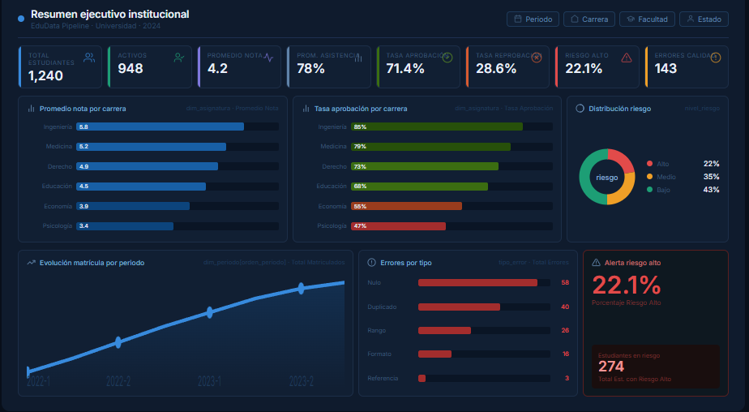

# EduData Pipeline

Pipeline ETL académico desarrollado con **Python, PostgreSQL, SQL y Power BI** para simular una solución de analítica institucional en una universidad.

El proyecto genera datos académicos simulados, los carga en PostgreSQL, los procesa en capas `raw`, `staging` y `mart`, aplica controles de calidad y finalmente disponibiliza la información en un dashboard ejecutivo construido en Power BI.

---

## Vista del dashboard



---

## Objetivo del proyecto

El objetivo de este proyecto es construir un pipeline de datos que permita analizar información académica institucional, considerando estudiantes, carreras, asignaturas, notas, asistencia, matrícula, riesgo académico y calidad de datos.

El proyecto busca simular un caso real donde una institución educativa necesita transformar datos crudos en información confiable para la toma de decisiones.

---

## Problema simulado

Una universidad cuenta con información académica distribuida en distintos archivos, como estudiantes, carreras, asignaturas, notas, asistencia y matrículas.

Estos datos pueden contener problemas de calidad, como:

* notas fuera de rango,
* asistencias inválidas,
* estudiantes inexistentes,
* asignaturas inexistentes,
* registros duplicados.

El pipeline permite cargar, limpiar, validar y modelar estos datos para generar indicadores institucionales en Power BI.

---

## Herramientas utilizadas

* **Python**: generación de datos simulados y carga de archivos CSV.
* **Pandas / NumPy**: creación y manipulación de datos.
* **PostgreSQL**: almacenamiento y procesamiento de datos.
* **pgAdmin**: administración de la base de datos.
* **SQL**: limpieza, validación y modelamiento de datos.
* **Power BI**: visualización y dashboard ejecutivo.
* **GitHub**: control de versiones y publicación del proyecto.

---

## Arquitectura del pipeline

El flujo general del proyecto es:

```text
CSV simulados
    ↓
Python
    ↓
PostgreSQL - raw
    ↓
PostgreSQL - staging
    ↓
PostgreSQL - mart
    ↓
Power BI
```

---

## Estructura del proyecto

```text
edudata-pipeline/
│
├── data/
│   └── raw_csv/
│       ├── carreras.csv
│       ├── asignaturas.csv
│       ├── estudiantes.csv
│       ├── notas.csv
│       ├── asistencia.csv
│       └── matriculas.csv
│
├── src/
│   ├── generar_datos.py
│   └── cargar_raw.py
│
├── sql/
│   ├── 00_create_raw_tables.sql
│   ├── 01_create_staging.sql
│   ├── 02_quality_checks.sql
│   └── 03_create_mart.sql
│
├── docs/
│   └── dashboard_resumen_ejecutivo.png
│
├── requirements.txt
├── .gitignore
└── README.md
```

---

## Capas del modelo de datos

### 1. Capa raw

La capa `raw` recibe los datos tal como llegan desde los archivos CSV.

Esta capa conserva los datos originales, incluyendo posibles errores de calidad. Su objetivo es mantener una copia cruda de la información.

Tablas principales:

```text
raw.raw_carreras
raw.raw_asignaturas
raw.raw_estudiantes
raw.raw_notas
raw.raw_asistencia
raw.raw_matriculas
```

---

### 2. Capa staging

La capa `staging` toma los datos desde `raw` y aplica limpieza, estandarización y validaciones.

En esta etapa se filtran registros inválidos, como notas fuera de rango, asistencias fuera de rango, identificadores inexistentes y duplicados lógicos.

Tablas principales:

```text
staging.stg_carreras
staging.stg_asignaturas
staging.stg_estudiantes
staging.stg_notas
staging.stg_asistencia
staging.stg_matriculas
```

---

### 3. Capa mart

La capa `mart` contiene los datos modelados para análisis y visualización en Power BI.

Esta capa es consumida directamente por el dashboard.

Tablas principales:

```text
mart.dim_carrera
mart.dim_asignatura
mart.dim_estudiante
mart.dim_periodo
mart.fact_rendimiento_academico
mart.fact_matricula
mart.control_calidad_datos
```

---

## Control de calidad de datos

El proyecto incluye una tabla de control de calidad que resume los errores detectados en la capa `raw`.

Controles implementados:

* notas fuera del rango válido 1.0 a 7.0,
* asistencia fuera del rango 0 a 100,
* estudiantes inexistentes en notas,
* estudiantes inexistentes en asistencia,
* asignaturas inexistentes en notas,
* asignaturas inexistentes en asistencia,
* duplicados lógicos en notas,
* duplicados lógicos en asistencia,
* duplicados lógicos en matrículas.

Esto permite demostrar que el pipeline no solo mueve datos, sino que también valida su calidad antes de construir la capa analítica.

---

## Dashboard en Power BI

El dashboard inicial corresponde a un **Resumen Ejecutivo Institucional**.

Incluye indicadores como:

* total de estudiantes,
* estudiantes activos,
* promedio de nota,
* promedio de asistencia,
* tasa de aprobación,
* tasa de reprobación,
* porcentaje de riesgo alto,
* errores de calidad detectados.

También incorpora visualizaciones para analizar:

* promedio de nota por carrera,
* tasa de aprobación por carrera,
* distribución del riesgo académico,
* evolución de matrícula por periodo,
* errores de calidad por tipo.

---

## Principales indicadores

Algunos de los indicadores calculados en Power BI son:

* **Total Estudiantes**
* **Estudiantes Activos**
* **Promedio Nota**
* **Promedio Asistencia**
* **Tasa Aprobación**
* **Tasa Reprobación**
* **Porcentaje Riesgo Alto**
* **Total Errores Calidad**

---

## Modelo en Power BI

El modelo utiliza una estructura analítica basada en dimensiones y hechos.

Relaciones principales:

```text
dim_estudiante[id_estudiante] → fact_rendimiento_academico[id_estudiante]
dim_asignatura[id_asignatura] → fact_rendimiento_academico[id_asignatura]
dim_periodo[periodo] → fact_rendimiento_academico[periodo]

dim_estudiante[id_estudiante] → fact_matricula[id_estudiante]
dim_periodo[periodo] → fact_matricula[periodo]
```

La tabla `control_calidad_datos` se utiliza para visualizar indicadores de calidad del pipeline.

---

## Cómo ejecutar el proyecto

### 1. Instalar dependencias

```bash
pip install -r requirements.txt
```

### 2. Generar datos simulados

```bash
python src/generar_datos.py
```

Este script crea los archivos CSV dentro de:

```text
data/raw_csv/
```

### 3. Crear esquemas y tablas raw

Ejecutar en PostgreSQL:

```text
sql/00_create_raw_tables.sql
```

### 4. Cargar los CSV a PostgreSQL

```bash
python src/cargar_raw.py
```

### 5. Crear capa staging

Ejecutar en PostgreSQL:

```text
sql/01_create_staging.sql
```

### 6. Crear control de calidad

Ejecutar en PostgreSQL:

```text
sql/02_quality_checks.sql
```

### 7. Crear capa mart

Ejecutar en PostgreSQL:

```text
sql/03_create_mart.sql
```

### 8. Conectar Power BI

En Power BI Desktop:

```text
Get Data → PostgreSQL database
Server: localhost
Database: edudata_db
```

Seleccionar solo las tablas del esquema `mart`.

---

## Valor del proyecto

Este proyecto demuestra habilidades en:

* generación de datos con Python,
* carga de datos a PostgreSQL,
* diseño de pipeline ETL,
* organización por capas `raw`, `staging` y `mart`,
* limpieza y validación de datos con SQL,
* modelamiento analítico,
* construcción de dashboard en Power BI,
* control de calidad de datos,
* documentación técnica para portafolio.

---

## Posibles mejoras futuras

Algunas mejoras que podrían agregarse en una versión posterior:

* automatización del pipeline con Airflow o Prefect,
* uso de Docker para contenerizar PostgreSQL,
* carga incremental de datos,
* publicación del dashboard en Power BI Service,
* integración con una fuente cloud,
* uso de dbt para modelamiento SQL.

---

## Descripción breve para portafolio

Pipeline ETL académico desarrollado con Python, PostgreSQL y Power BI. El proyecto simula datos institucionales de una universidad, los procesa en capas `raw`, `staging` y `mart`, aplica controles de calidad y genera un dashboard ejecutivo para analizar rendimiento académico, asistencia, matrícula, riesgo estudiantil y calidad de datos.
